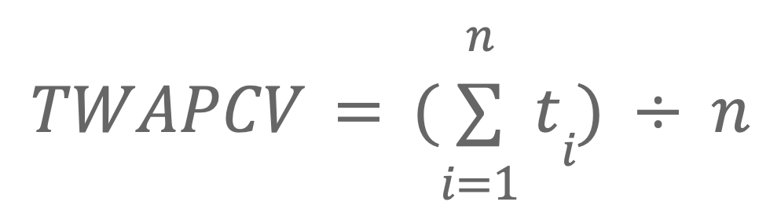
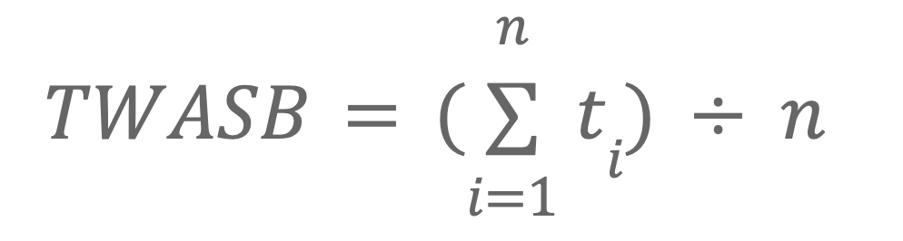

# Overview
Market governance seeks to create a crypto economic incentive aligned system balancing supply and demand between capital suppliers and capital allocators. Users supply capital in the form of VOLT, and the protocol adjusts the VOLT rate to manage liquidity and reach an efficient market equilibrium.

VCON holders make risk decisions through liquid allocation of capital and are exposed to the associated risk and return. Allocation into venues that suffer losses or underperform versus the VOLT rate for a sustained period of time will be subject to liquidation. Profits are split between the system surplus and the VCON allocators based on utilization.

VOLT supply expansion and contraction is regulated by interest rate curves (similar to a Compound style market with a utilization curve) and a controller that adjusts this curve to find a market rate. The system will algorithmically determine the yield paid to VOLT holders to guide the system toward a target surplus buffer ratio decided by governance.

Market governance is a control system, a set of feedback loops that connect the VOLT holders who are “lenders” to the system, and the VCON holders who are the “borrowers”. The following sections describe in detail how the system calculates interest rates, accounts for yield, and handles liquidations.

# PCV Accounting
The entirety of capital within the VOLT system is referred to as “protocol controlled value” or PCV. The PCV is broken down into two buckets.

## Reserves
Reserves are used either to provide liquidity for VOLT holders seeking to exit (funds inside a custodial Peg Stability Module), or simply held idle for future use along these lines.

The target value for the reserves will likely be determined by governance in an early version of the system, and later dynamically based on the surplus buffer ratio, the size of the surplus buffer vs the size of the PCV as a whole. When the surplus buffer is too small, more PCV should be held idle to prevent unsafe amounts of leverage being granted to VCON holders, which causes incentive alignment to break down.

## Market-governed value
Market-governed value (MGV) is the portion of the PCV which is controlled by VCON market governance to earn yield. VOLT holders can also redeem directly against liquid MGV for a nominal fee. When the capital in the PSMs exceeds the target reserves level, it is considered MGV instead of reserve capital and eligible for allocation by VCON holders. Likewise, when the reserves are depleted, a rebalance can be triggered to move capital out of the market governance venues. The MGV is calculated as PCV - reserves.

## System Surplus
Sometimes called the “surplus buffer”, this is defined as the total PCV minus the value of all circulating VOLT. The system surplus is not a separate bucket or specifically distributed in either the reserves or the market-governed value. It is the “equity” of the protocol, originating from VCON holders who add capital to the system in exchange for VCON tokens, or accrued from system fees.

The system surplus is significant in determining certain rates within the system. When the surplus is large vs the total PCV, a higher rate is paid to VOLT holders, and vice versa. Likewise, when the surplus is large vs the total PCV, the size of the reserves can shrink, and vice versa.

## Time-weighted averages
There are two significant values tracked in system memory relating to the PCV, a "Time Weighted Average PCV" and a "Time Weighted Average Surplus Buffer". These values are used in calculations to decide the VOLT rate, which are described under [Interest Rates](#interest-rates).

### TWAPCV

TWAPCV is calculated as

where:
* `t` equals a snapshot of the total PCV at a point in time using manipulation resistant balances
* `n` equals the total number of periods to measure across
* `i` is the period’s index, which starts at 1

### TWASB
Trailing Weighted Average Surplus Buffer (TWASB) can be calculated with the same formula formula,

where:

* `t` equals a snapshot of the total surplus buffer at a point in time using manipulation resistant balances
* `n` equals the total number of periods to measure across
* `i` is the period’s index, which starts at 1.

# Supply Calculations

## Supply Changes
When a user mints VOLT, the idle stablecoin balance in the system will go above the target reserve level, and vice versa for redemption. Any stablecoins in the PSM in excess of the reserves target are eligible to be converted into MGV and deployed via market governance. Rebalance need not occur on every mint or redeem, and instead can be incentivized and automated to occur only when the reserves exceed or drop below target by a certain threshold. The early system will likely use a static reserve target. A dynamic fractional reserve calculation will have a similar result but improve efficiency.

## Total Supply
The VOLT Rate is based in part on the time weighted average PCV (see “The VOLT Rate” under “Interest Rates”), which depends on a calculation of the current PCV which is snapshotted at multiple points in time. It is difficult to account for the amount of circulating VOLT on L2 networks such as Arbitrum without regular oracle reporting from L2 to L1. To resolve this difficulty, pessimistic accounting is used, where all the VOLT in L2 PSMs is considered to be circulating. As a result, the only VOLT tokens that are excluded from the VOLT rate calculation are those uncirculating VOLT held in mainnet PSMs, while uncirculating VOLT on L2 is considered to be part of the active supply. This amount should not be large, and can be updated if action is taken to reduce the total authorization of an L2 PSM.

# Minting and Redemptions
A VOLT holder can mint VOLT by depositing stablecoins or redeem for the same in the liquid buffer for no fee. Alternatively, they can pay a nominal fee to prevent griefing and withdraw directly from a market governance venue with available liquidity. When they do so, they “repay the debt” pro rata of all VCON holders in that venue. Not all venues will permit this (some are illiquid), but a significant proportion of liquid on chain venues will allow smooth redemption flow for VOLT holders.

While the contracts will allow VOLT holders to obtain liquidity from any VCON holder, the front end can default to obtaining liquidity from any VCON holders currently above their pro rata share, helping to reduce the need for VCON holders to initiate rebalances.

## Rate Limits

A limit is necessary on redemption through the PSM to ensure that losses in yield venues can be properly accounted for. If Volt Protocol took a loss in one of the PCV yield venues that exceeded the size of the surplus buffer, which would not be instantly knowable on chain (sentinel must report existence of bad debt positions to take action), sophisticated users could exit at the old, full target price. This occurs at the expense of less sophisticated users and is undesirable. A reasonable global rate limit on VOLT redemptions would allow all but the largest institutional users (ie, an exchange or major fund) to exit atomically, and keep the delay for these larger users down to a reasonable time for the loss liquidation auction or other mechanism to mark down the value of bad debt. This limit should never be set so low as to inconvenience users during healthy operation and can be adjusted based on market data. We can envision a market dynamic approach where when redemptions occur, the rate limit increases, and then decays when there is low redemption demand.

# Market Governance

Market-governed value (MGV) is the portion of the PCV which is controlled by VCON market governance to earn yield, calculated as the total PCV minus the reserves. A VCON holder can direct MGV to a whitelisted yield venue, subject to its own liquidation rules. VCON holders who do not participate in market governance implicitly delegate their voting power to those who do. Therefore, there is no explicit restriction on the share of the MGV a given VCON holder can borrow, so long as that MGV is currently idle. If only one VCON holder participates in market governance, they can direct the entirety of the MGV.

VCON holders can always rebalance among themselves to an equal pro rata share of MGV. If a VCON holder is currently borrowing more than their pro rata share, any other VCON holder with less than their pro rata share can trigger a rebalance to their own benefit. If one holder was directing the entire MGV, another holder with an equal VCON share could trigger a rebalance to gain control over half of the MGV. There may be a nominal fee on the rebalance to prevent griefing.

A VCON holder can modify their position by withdrawing funds from their chosen venue and moving them into a new whitelisted venue. During this withdrawal, checks are performed to ensure that the yield venue did not suffer a loss, and fail if not enough PCV was withdrawn from the underlying venue. When a market governance participant withdraws from or deposits into a venue, a rebalance is triggered if either the origin or target venue has an incorrect PCV share due to redemptions (see section below).

## VCON Delegation
VCON holders can delegate their market governance power to other accounts. To be eligible as a delegate, an account must opt in. As part of this, the new delegate can set their desired fee split, and choose whether or not to enforce a delegator whitelist. A VCON delegator can choose to remove their delegation at any time, converting back into a standard VCON position which can be repaid and closed out if the underlying funds were in a liquid venue.

## Interest Rates
The following sections will describe the different interest rates and curves within the VOLT system, how they interact with each other, and how they are derived. It is critical to note that under market governance, interest rates are calculated in a control system with memory and feedback, not constant curves.

### The VOLT Rate

When there is no market governance activity, and the surplus buffer ratio is at target, the rate earned by VOLT holders is equal to the yield earned in the base yield venue according to a time weighted snapshot. The actual surplus buffer size is snapshotted as described in the Rate Checkpointing subsection.

At a regular interval, when the surplus buffer is above or below the target ratio, the interest rate paid to VOLT holders is adjusted above or below the base yield venue rate. This means that when redemptions occur, the remaining VOLT holders will earn higher yield, and when supply expands quickly, yield per VOLT will decrease. Once the system returns to the target surplus buffer ratio, it will keep the newly discovered market rate for as long as it remains in balance.

The interest rate VOLT holders receive is calculated as

`v = i * m * (r /t) ^ k`, where

* `v`  is the actual rate paid to VOLT holders as well as the borrow cost for VCON holders. It is the system’s primary cost of capital for liquid deposits.
* `i` is the yield of the “base yield venue” (which is described in the section with the same name), meaning the opportunity cost for capital assigned to market governance. This is the minimum yield paid to VOLT holders under conditions when the surplus buffer is at or above target.
* `m` is the base yield pass through ratio, where m=1 means that exactly the full base venue yield is passed to the VOLT holder, m=0 means VOLT holders receive no yield, m of 10 means they earn 10x the base venue yield. Incremented up or down at regular intervals when the system is above or below the target surplus buffer. Remaining above the target surplus buffer for a long time will lead to a high m, and vice versa. As VOLT holders will never earn negative yield, m >= 0. 
* `r` is the ratio between surplus buffer and the PCV, calculated based on a time weighted moving average as r = TWASB / TWAPCV, where [TWAPCV](#twapcv) is the time weighted average PCV, and [TWASB](#twasb) is the time weighted average surplus buffer
* `t` is the target ratio between the surplus buffer and the PCV, a system constant set by governance
* `k` is the sensitivity of the system to short term deviations from the target surplus buffer ratio. A k of zero means that VOLT holders receive a constant yield that never deviates from the base yield venue rate, a k of 1 means that the yield VOLT holders receive is 1:1 directly proportional to the level of deviation from the target yield rate, and a k of 1000 means the system is extremely sensitive to deviations from the target.

When market governance is active, the yield earned, less the profit share with VCON holders, will be accounted for in the time weighted average yield snapshotting. The interest rate paid by VCON holders is expressed in the VOLT price, since they borrow and repay VOLT with no explicit fee outside of profit sharing.
Market Governance Fee Split

Interest is accounted for whenever protocol assets enter or exit a yield venue, such as when a VCON holder takes profits, or a VOLT holder redeems. All yield is initially split into two – a portion that accrues to the VCON holder, and part for the surplus buffer (and ultimately the VOLT holders).

### VCON Revenue Split

The profit split between VCON holders and the surplus buffer (setting aside the portion going directly to VOLT holders through the current rate of price appreciation) is adjusted based on the utilization of market governance. If most VCON is participating in market governance, the VCON holders will receive a low share of the returns, as this likely means they are obtaining high leverage and a healthy profit. If little VCON is participating, that which does will get to keep most of the returns it generates above the base venue rate. During longer periods of high utilization, the base profit split will adjust down, and vice versa.

The profit split for VCON holders is calculated according to a similar equation as the VOLT rate, whose terms are described below.

`p = y * n * (u / t) ^ k`
`y` is a VCON holder’s profit
`y` is the actual yield generated in the venue in excess of the VOLT rate
`n`  is the base fee split ratio when VCON is at target utilization, adjusted up or down by the controller. `0=<n<= 1` as VCON holders must earn between 0% and 100% of profits.
`u` is the time weighted average VCON utilization
`t` is the target VCON utilization, a system constant set by governance
`k` is the sensitivity of the system to short term deviations from the target market governance participation rate. A `k` of zero means that VCON holders receive a constant fee share, a `k` of 1 means that the yield VCON holders receive is 1:1 directly proportional to the level of deviation from the target participation rate, and a `k` of 1000 means the system is extremely sensitive to changes in utilization. 

## Yield Venues
Market governance venues are both per currency and per protocol, so the Aave v2 DAI market, with tokenized deposit receipt aDAI, is considered a separate venue from the Aave v2 USDC market, with deposit token aUSDC.

Each venue for market governance has its own accounting and liquidation rules. Whenever a VCON holder allocates into or out of a venue, the cumulative yield must be calculated. A per venue basis instead of a per VCON holder basis keeps things organized. Liquid venues like Aave will allow for direct redemption by VOLT holders as described above. Some venues may be less liquid than others and have longer to meet “margin calls”. For example, a real world asset loan might have thirty days to repay when called.

If one venue has more than its share of PCV based on market governance allocation due to VOLT holders redeeming, anyone can trigger a rebalance between this and another venue or venue(s), “paying off the debt” of VCON holders in the oversaturated venue. In the case of an illiquid venue, another VCON holder can assume ownership of the debt even if the underlying collateral asset cannot be liquidated.

All Yield venues will have the following set of parameters set on instantiation and changeable by governance. The margin call period is the length of time VCON holders are given to repay their debts if a liquidation is triggered. The liquidity profile of a venue will be attached to the venue so that the system can be aware of the liquidity profile of its PCV through a Collateralization Oracle. Yield oracles will be instantiated for all yield venues and will track the performance of the venue over a period of time.

Yield venues can be broken down into three types based on their liquidity characteristics.

### Venue Types

#### Frictionless liquid
Based on the premise that the default state of PCV is DAI or USDC, there is no cost to enter or exit these venues. This applies to lending markets like Aave or Compound, and any similar venue that accepts DAI or USDC with no mint/redeem fees (or other stablecoins that offer zero fee PSMs with the above).

#### Liquid with fee
Stablecoin yield venues such as Curve, or deposits in Aave style markets of stablecoins that cannot be obtained using DAI or USDC without paying a swap or mint fee. In this venue category, VCON holders must pay the switching costs (swap fee) when rebalancing between PCV stablecoins. Guardian actions are vulnerable to griefing and must pass on the switching cost, either as a fee or with a bonding mechanism subject to governance.

#### Illiquid
The initially supported venue types will all be liquid on chain, but in the future Volt Protocol will be extended to support assets or strategies with a range of liquidity profiles, including real world assets and fixed-duration lending. These venues may have more complicated rules for liquidation or pricing of collateral, and may have additional restrictions such as deposit caps.

### Liquidation Mechanism
If PCV is illiquid (or in the case that losses were taken in a yield venue), either a Guardian or, in the future VOLT/VCON bonder can trigger a “margin call” or “gib” on VCON holders. If they do not return the loan within a predetermined period of time, their VCON is burnt and the system surplus absorbs any losses. Since it may not be possible to immediately and trustlessly tabulate losses on chain, the loss can initially be marked down to zero and liquidation proceeded through another mechanism.

There is no partial liquidation for VCON holders – if the loss in the underlying venue is less than the value of their VCON, it is their responsibility to restore the PCV.

After the “gib”, seized collateral is transferred to a venue where governance can decide how to value or dispose of it, generally either by marking down and reuniting with the main PCV if liquid, holding to maturity if needed, or in some cases perhaps auctioning off. Accounting problems in the event of venue losses are the most likely situation that would need intervention.

### Base Yield Venue
The Base Yield Venue is not necessarily a single venue but a default strategy when no active market governance occurs. The rate generated by the base yield venue is the minimum rate VOLT holders will receive when the surplus buffer ratio is at target. The initial base yield venue may be a strategy that allows rebalancing between a few high quality venues and assets.

When there is no participation in market governance, all PCV defaults to the Base Yield Venue. PCV restricted from use in market governance and held in the reserve will also be included in the Base Yield Venue if not held in a custodial PSM.

The base venue is liquid and should have no fee for VOLT holders who wish to redeem directly, vs market governance which may have a nominal fee to prevent griefing.

### Internal Yield Venues
Besides external yield venues, Volt Protocol is likely to develop its own lending markets and yield strategies to allow for ever more customizable risk and return strategies for VCON market governance. An example would be a native market for lending against ETH, where users can always access the best borrowing rate among Volt Protocol and its supported venues, and without any other long tail assets that add risk for the protocol.

## SubDAOs and Parameter Tuning
Despite our efforts, there are certain system parameters that may need human intervention to tune, or judgements to be made such as marking down the value of collateral after losses in a yield venue due to an exploit. Instead of a monolithic token governance, Volt Protocol will use the specific quorum sizes and veto rules for each “knob” that can be turned in the system. This way, smaller decisions can move more quickly through governance in specified contracts, and larger system changes will require more buy-in from stakeholders.

For example, adjusting the k value described in the Interest Rates sections below would be subject to different rules than adjusting what % of VCON supply may be sold in a given Surplus Buffer Auction. In turn, updating the core system contracts would have far stricter requirements than the above.

### Classically Governed Parameters

#### Target surplus buffer ratio
The target ratio between the system’s reserves in excess of the backing of the VOLT supply, and the total circulation of VOLT. This important system constant should be determined by governance based on the overall risks of the whitelisted yield venues. Exceeding this threshold for prolonged periods will cause the VOLT system to adjust baseline rates down, and vice versa.

#### Target VCON Utilization
The target portion of the VCON supply engaged in market governance. This important system constant should be determined by governance based on the performance gains of market governance vs more static yield deployments. Exceeding the target threshold for prolonged periods will cause the share of system profits distributed to market governance participants to reduce, and vice versa.

#### Surplus buffer deviation sensitivity
Referred to as “k” in the relevant equations, this is the system’s sensitivity to immediate term deviations from the target surplus buffer ratio. A higher k means a larger change in the VOLT rate in response to deviations from the target surplus buffer size. This system constant should be determined by governance through models and simulations to determine an optimal sensitivity to meet the system’s liquidity needs at a given time, based on the composition of the PCV and the velocity of the VOLT supply.

#### VCON utilization deviation sensitivity
Another k, this constant is similar to the above and determines how sensitive the VCON profit share is to deviations from the target participation rate in market governance. This constant should be determined by governance to allow VCON holders reasonably consistent fee share while still adjusting to supply and demand.

#### Auction parameters
What portion of the VCON supply can be sold in a given auction to grow the surplus buffer, and the maximum frequency of these auctions, are important questions for the growth of Volt Protocol. It is difficult to determine how decision making about VCON emission can be performed purely through market governance at this stage. A later implementation may attempt to allow market governance to control the frequency and size of VCON auction.

## VCON and the Surplus Buffer

### VCON Auction
Merely accumulating the surplus buffer from system fees constrains expansion. VCON auctions can be used to grow the surplus buffer and allow more rapid expansion than reliance on fee accumulation while remaining within safe bounds. At regular intervals, a VCON auction can be triggered with a minimum price equal to the value of the surplus buffer divided by the VCON supply, plus a mint fee. The maximum size and frequency of VCON auctions can be determined by governance.

### Ragequit
VCON holders can “ragequit” in exchange for a pro rata share of the surplus buffer less a redemption fee. This allows capital to exit the system when the surplus buffer is too large relative to the PCV, if the system were to become defunct, or if they judge their fellow VCON holders to be taking unacceptable risks in governance. The process is rate limited so VOLT holders can react to fluctuations in the size of the surplus buffer.

# Edge Cases

Extreme system leverage means the ratio between the VOLT supply and the surplus buffer is very high, meaning there is a risk that VCON holders have insufficient skin in the game when participating in market governance. This is mitigated by the leverage factor and increasing the portion of funds retained in system reserves when the surplus buffer is too small.

Loss of Funds in yield venues. This may not be accurately reflected in on chain balances. The process for marking down a cToken with bad debt or other similar decisions may require governance intervention outside of the market governance framework.

# Hypothetical Implementation

Consider an implementation based on a Compound style lending market. Each venue for market governance should be tokenized with its own system price based on accrued yield.

VCON tokens would have a system price derived from their borrowing limit.

The base form of PCV is VOLT. VCON holders borrow VOLT and convert it into other tokens through the system routers, which are added to a given holders’ position. The interest rate model for VOLT is determined by a Volt Interest Oracle Module based on the surplus buffer ratio and average market governance yield. The VOLT price increase defaults to the Base Yield Venue rate (which might be aDAI-aUSDC-cDAI-cUSDC optimized strategy or other form) when not influenced by market governance.

VCON holders can be liquidated if they underperform the VOLT rate for too long, based on the VOLT price increasing faster than the value of their tokenized venue positions, and cannot remove their VCON collateral without repaying their loan first.

The additional special feature would be allowing VOLT holders to repay VCON holder debt and obtain the underlying yield venue tokens (but not VCON). In the normal Compound markets, anyone can repay debt, but not obtain the collateral tokens.

# Alternative Denominations
Market governance can be applied to alternative denominations of capital besides USD. The same infrastructure that will govern VOLT can be extended to support vETH, a market governed ETH-denominated currency. Other “fiat” denominations are also possible, if there is on chain holder demand to support tokenization. Supporting multiple capital types will enable efficiency gains in lending, borrowing, and exchange.

## vETH
There are several advantages to including an ETH derivative in the VOLT system. The same market governance codebase can support allocation of ETH or its derivatives into yield venues, or even conduct Rocket Pool-esque decentralized staking. Volt Protocol can internalize borrow aggregation and peer to peer matching functions in the future, such as allowing vETH holders to borrow in stablecoins at whichever is lowest among the VOLT rate or the whitelisted yield venues.

# Checks and Balances
Profit motive for VCON holders alone is insufficient to ensure certain protocol functions are performed correctly from the perspective of VOLT holders. To prevent abuses, checks and balances will be added outside of market governance. Most prominent among these are the two “Nope DAOs”, mechanisms by which VOLT or VCON holders can veto system changes. This applies to any governance action, such as parameter adjustments or onboarding of new yield venues. Different quorum thresholds may be used for different types of changes.

## VOLT Veto Module
A quorum of XX% of the VOLT supply will be able to veto any governance proposal, with the veto threshold proportional to the portion of the VCON supply voting in favor. These proportions can be adjusted by governance. 1% of the VOLT supply shouldn’t be able to overrule 90% VCON consensus, but 1% of the VOLT supply stopping a minimal VCON quorum from pushing through a change might be fair.

## VCON Veto Module
A minority of XX% of the VCON supply can veto a proposal passed by a larger VCON majority. This means that a small quorum can pass uncontroversial proposals, but larger participation is needed if there are dissenters.

## Emergency Mode
Either VCON or VOLT holders can blacklist a yield venue with an appropriate quorum. This activates “Emergency Mode” as described in this document, where further deposits into the venue are blocked and a Sentinel attempts to withdraw funds.

## Venue Vesting
When a new yield venue is onboarded by VCON vote, it will have a deposit ceiling that starts at 0 and increments toward 100% (or perhaps some other maximum, depending on venue type) of the PCV over a significant period of time. This allows for VOLT or VCON holders to act to blacklist a malicious or dangerous venue even after it has been onboarded. 
