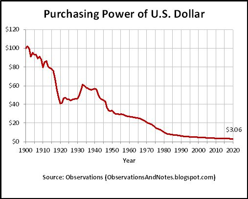

# ⚡VOLT⚡
Inflation erodes the purchasing power of savers over time. Unpredictable inflation rates make it impossible to plan ahead financially when the value of money itself is in flux. The US dollar lost 7.9% of its value in the last year, and the Euro 5.9%, the highest inflation rate in 39 years. Volt offers a solution -- a stablecoin that combats inflation by tracking real world prices, rather than pegging its value to a depreciating fiat currency.

VOLT will start at a price of $1 and is designed to adjust over time according to Consumer Price Index (CPI) data. Like MakerDAO’s DAI, VOLT will be backed by a mixture of user-deposited collateral and protocol-controlled assets.

 
# Volt and the CPI

The U.S. Federal Reserve targets an inflation rate of 2% annually which is designed to erode purchasing power over time and incentivize those who hold wealth to either spend or invest. This investment provides jobs and stimulates the economy. While this goal makes sense, inflation unfairly punishes savers. The public is forced to choose between speculating on volatile assets like stocks or real estate, or accepting negative real rates in their savings accounts.

Volt's solution is to base its price on the Consumer Price Index instead of the price of an existing fiat currency. Unlike other stablecoins which are always minted or redeemed at a price of $1, the price of VOLT changes over time to account for inflation.

VOLT selected the CPI-U or Consumer Price Index for Urban Consumers as the source of truth for inflation. The CPI-U is composed of data collected by the Bureau of Labor Statistics (BLS) on consumer prices in urban areas. It tracks the prices of goods and services in relation to the starting index price for those same items in 1982.

VOLT uses the CPI-U as its inflation benchmark because it most accurately reflects the rising costs consumers pay due to inflation in the real economy. The BLS collects new prices and reports new CPI-U data monthly.

During certain times of the year, prices of selected goods and services predictably rise due to seasonal changes in consumer demand. An example of this is propane gas whose price rises in the winter due to increased demand. Because certain goods and services increase in prices based on seasonal demand, the BLS has two data sets on inflation. One which is adjusted for seasonal changes in supply and demand, and one which is not adjusted for seasonal factors. Because all changes are applied over a one year period to smooth volatility, the VOLT unit of account will use non-seasonally adjusted numbers because they most accurately track real price changes.

One common critique of the CPI-U is that it isn’t weighted heavily enough towards housing, which represents a large and growing portion of expenses for most people. We chose to use the official CPI-U numbers despite these criticisms because it is a major Schelling point in the financial system.

## Chainlink Oracles
In order to get this data into the VOLT system, VOLT will use a Chainlink oracle to feed the newest monthly CPI data into the VOLT price oracle. Each new piece of data from Chainlink will be retained for 12 months to calculate the Trailing Twelve Month (TTM) inflation rate. Chainlink was chosen because it is the most well established and legitimate oracle provider. As VOLT scales, we will seek to increase the number of nodes reporting and add additional security checks to our price source of truth. In the event of an oracle failure (either nonreporting or an incorrect report), Volt will continue to apply the old inflation rate until the oracle can be safely updated.

## Open Price Oracle
The VOLT system will create and expose a public smart contract API that any project can use to get the system price of VOLT, in other words the current CPI index. This will allow other projects to coordinate around this Schelling point for a unit of account that preserves purchasing power through time. Other projects including Frax Price Index FPI plan to use this API in their token design. This will create network effects around the VOLT unit of account and encourage deep liquidity on decentralized exchanges.

# VOLT Issuance
There are two main mechanisms for VOLT issuance, the peg stability module (PSM) and debt issuance through Fuse. Like MakerDAO's DAI, VOLT can be issued either through overcollateralized debt positions, or by deposit of stablecoins into the PSM.

## Peg Stability Module
VOLT will be issued through a Peg Stability Module (PSM) which will allow users to either mint or redeem VOLT at the current target price reported by the Volt Price Oracle in exchange for accepted stablecoins. All proceeds from VOLT minting will be immediately deployed into yield venues chosen by governance. Conversely, when a user wishes to exchange their VOLT for stablecoins, they can always swap with the PSM at the current VOLT target price. Stablecoins are then withdrawn from the yield venues and given to the user in exchange for VOLT.

At launch there will only be a FEI PSM, with all PCV FEI deposited in a single yield venue, Fuse pool 8 (FeiRari DAO Pool). Following launch governance will onboard additional yield venues, starting with additional Fuse pools and then external platforms.

The PSM will charge a fee on VOLT issuance, with no fee on redemption. At launch the fee will be set to 2% to encourage building up a larger system surplus and may be altered in the future by governance.

## VOLT Issuance on Fuse
In addition to the PSM, VOLT can be minted through supported Fuse pools. VOLT issuance pools will use the VOLT Price Oracle rather than market price data for the purposes of lending and liquidations. This means that borrowers are safe from being liquidated due to excess VOLT demand, and VOLT is not overvalued in these pools as collateral during times of high demand. At launch, only pool 8 (FeiRari DAO pool) is supported.

## Buffer Caps and Gradual Issuance
Both supported Fuse pools and PSM venues will have buffer caps and daily issuance limits, meaning VOLT supply increase will be constrained to a predictable and gradual rate. At first, the buffer cap and daily issuance will be set to support the goal of issuing at most 30m VOLT through Fuse and 10m through the PSM prior to our LBP and token incentives. In the future, the rate will be set to a level judged appropriate based on available liquidity and demand for VOLT.

## TRIBE Launch Support
The TRIBE DAO approved a [token swap with Volt Protocol](https://tribe.fei.money/t/fip-88-volt-joins-the-tribe/4007) which will add 2.4 million FEI to the system surplus. Additionally, the TRIBE DAO will allocate 10m FEI to mint VOLT and backstop liquidity during the launch period.

## Monetary Policy
The VCON DAO seeks to earn yield equal to or greater than inflation on protocol assets, with the goal of increasing the buffer of VOLT's backing over time. The goal is to preserve purchasing power over the long term, so the protocol should take a conservative approach in authorized yield venues.

## Collateralization
Like Fei Protocol, Volt's PCV will always be overcollateralized. At launch, the system will be only slightly overcollateralized due to the fee on VOLT issuance. Provided the protocol earns yield greater than inflation on protocol assets, collateralization will increase over time. New VOLT issuance through the PSM lowers the collateralization ratio toward 1:1+issuance fee. As a result, the DAO will limit the rate of VOLT issuance when the buffer is too small, or increase issuance if the buffer grows sufficiently. In the future, the DAO will seek to standardize the VOLT supply expansion rate according to a consistent schedule. Supply is regulated based on the protocol's ability to source yield at an appropriate risk level.

# VCON Tokenomics & Governance
The role of the VCON token is to direct the protocol's assets among yield venues to outperform inflation without taking on excess risk. The full scope of the VCON token will not be enabled at launch, but is described in the section "Liquid Governance".

## VCON Distribution
The VOLT system will be launched prior to the creation of the VCON governance token. One month after system launch, the VCON governance token will be created with a total supply of 1 billion tokens. See section “Launch plans” for more details. Of this supply:
* 10% was allocated for a seed round raising $2m to support VOLT development, on a three year linear vest with one year cliff.
* 20% for VOLT contributors, on a four year linear vest with one year cliff
* 42% for DAO partners
    * 30% to the TRIBE DAO which has incubated and is jointly building VOLT. 6% given directly to the Tribe DAO in exchange for incubating VOLT, and a swap [as approved on Snapshot here](https://snapshot.fei.money/#/proposal/0x33c689b49e000f7380fc16b7c366d37f9088db5427d544e073f245e4b48bb243)
    * 6% given to OlympusDAO in exchange for participation in the Olympus incubator and onboarding VOLT as a treasury asset
    * 6% offered to Frax Finance as a token swap for FXS in recognition of our joint efforts coordinating on a CPI index. FXS obtained will be locked as veFXS and used to enhance VOLT liquidity through gauge votes
* 18.1% reserved in protocol treasury for token incentives, bonds, or future treasury swaps
* 10% issued in LBP to efficiently bootstrap VCON market

Vesting participants will be able to use their VCON in the "Liquid Governance" system described below, but will not otherwise be able to transfer it during the vesting period.

## Direct Decentralization Through DAO Partners
The VOLT Protocol has been developed in partnership with the Fei / Rari Tribe. Along with the support of other partners including OlympusDAO and Frax, we're decentralizing VOLT by distributing VCON to existing token communities. The protocol is currently governed by the Treasury Multisig currently consisting of Volt Protocol founder Kirk Hutchison, Fei Protocol founder Joey Santoro, Frax Finance founder Sam Kazemian, OlympusDAO representative Glueeater, and Gabagool.eth, a well regarded investor and community member. This multisig governs the DAO treasury, remaining answerable to the partner DAOs who control the largest stakes in Volt. After the launch of the VCON token, holders will be able to veto decisions by the Control Multisig in the form of a “Nope DAO”.

## Liquid Governance
*Please note that the following section, Liquid Governance, describes planned components of the system not enabled at launch*

The goal of the VCON governance system is to allow for fully liquid, block-by-block allocation of PCV among yield venues and adjustment of debt ceiling between issuance pools.

This means that allocation of Volt's PCV must be a **market outcome**, not a governance decision. It is essential to let tokenholders directly allocate protocol assets while having the proper skin in the game. They must benefit or suffer most from their individual governance decisions, not the result of majority consensus or the efforts of others. We accomplish this with a special lending pool for VCON holders, based on the Tribe TURBO system.

The VCON Pool will be the same as the VOLT issuance pool described in the "VOLT Lending" section above, and will also be the recipient of all assets deposited into the PSM. VCON holders will be able to borrow VOLT or other protocol assets subject to a set of special terms and constraints:

* use a system price for VCON instead of market price so holders can borrow their pro rata share of assets
* the pool will have only forced liquidations (see ["gib"](https://github.com/fei-protocol/tribe-turbo)), as the deposited VCON is used for governance rather than to "back" the assets in the pool
* if borrowing VOLT, pay small premium as "reserves fee"
* if borrowing other stablecoins, pay inflation rate plus "reserves fee"
* borrowers can only deposit assets into authorized yield venues, like TURBO, not just walk away with them
* offer incentives on borrowing in this pool so active VCON holders dilute passive holders, and to ensure utilization remains high

Note that in this model VCON holders directly access a cash flow based on their independent risk management. What they can earn allocating VOLT or PCV stablecoins in excess of inflation and the reserves fee, they keep.

The long term goal of the VCON DAO is to remove as many arbitrary, vote-based actions from the system as possible. To build the most scalable and powerful system possible, we must rely on markets rather than governance.

# Launch Plans

## Audits
VOLT has been audited by Zellic with no vulnerabilities found. (https://github.com/code-423n4/2022-03-volt/tree/main/audits)
Volt is currently undergoing a [Code4rena](https://code4rena.com/contests/2022-03-volt-protocol-contest) public audit. After launch, the DAO will offer competitive bug bounties that scale as Volt does.

## Guarded Launch
The VOLT issuance system will be launched prior to the VCON governance token. In this early stage, it will be administered by the Volt DAO multisig consisting of Volt Protocol founder Kirk Hutchison, Joey Santoro (TRIBE), Sam Kazemian (FRAX), Glueeater (OlympusDAO), and gabagool.eth (Information Token). Both Fuse issuance and the PSM will be subject to limits during this period. At launch, there will be a debt ceiling of 30m VOLT on Fuse and 10m in the PSM. There will be a daily "drip" of additional VOLT into both PSM and Fuse at a rate adjustable by governance. The initial drip rate is zero and will be adjusted based on market data after launch.

## Liquidity Bootstrapping Event
Plans for the launch of the VCON governance token are tentative. The launch will occur publicly, with 10% of the token supply available, and take place approximately a month after VOLT issuance is live. VCON will be launched in a liquidity bootstrapping pool (LBP) or similar mechanism. An LBP is a mechanism for on chain price discovery of a new token that resembles a Dutch Auction. The LBP will be seeded with VCON governance tokens and protocol controlled FEI. The LBP will start at a market cap of $250m for VCON or $0.25 per VCON token and last for a week. The pool will be seeded with 9.9% of the VCON supply, 99m VCON tokens and 250k FEI at a 99/1 weighting. Half of the proceeds of the LBP will be held by the DAO treasury as liquidity for VCON/FEI, the other half added to the surplus to backstop VOLT.

## VOLT and VOLT DAO
At launch, the Volt DAO will convert 1m of its treasury assets into VOLT, to hold on the balance sheet and compensate contributors. VOLT is a new and better form of money, and we’re excited to be its first users.

## VOLT and L2
There are still substantial risks to lending operations on layer 2 scaling solutions such as optimistic or zk rollups. Most notably, if the rollup experiences downtime, it will likely be impossible to efficiently liquidate insolvent borrowers. This could expose the protocol to the risk of total loss. As a result,the DAO won't mmediately conduct lending operations or PCV issuance on any L2, but will plan to promote VOLT bridging in the short term.

## Next Steps
After launching the system, the Volt core team will seek to add support for additional issuance Fuse pools as well as yield venues for protocol controlled value. The top priority will remain keeping the system safe while we complete development of the Liquid Governance system, which will enable VOLT to become truly scalable decentralized money.

# Disclaimers
VOLT is an experimental open system, all participants should be aware that there are substantial risks involved when interacting with any new smart contract product or economic system. The developers of VOLT, whether individuals or entities, do not make any guarantees about returns on the VCON token. VOLT borrowers are responsible for their own risk and should be careful with leverage. Any desirable properties of VOLT are expressed in the smart contracts and are not a guarantee offered by any individual or corporation.

All code used in the VOLT system will be audited and open source, and the system’s state will be observable on chain. Please do your own research and enjoy responsibly.

